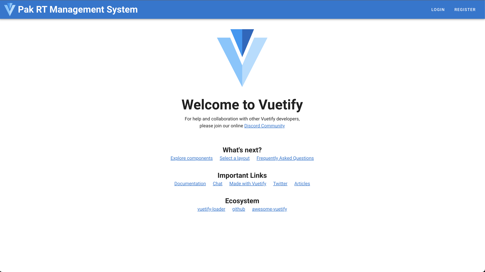
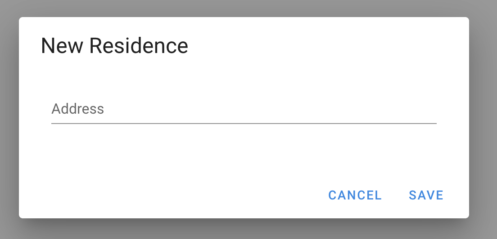
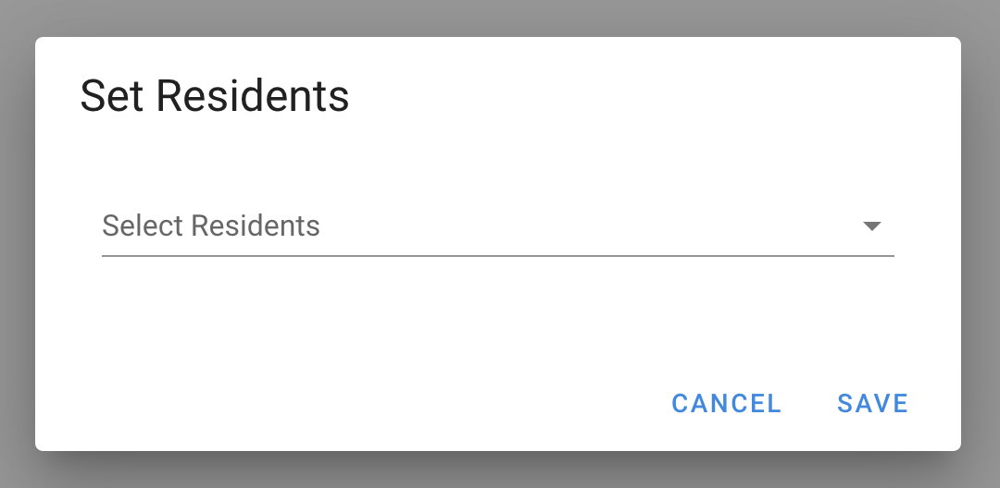
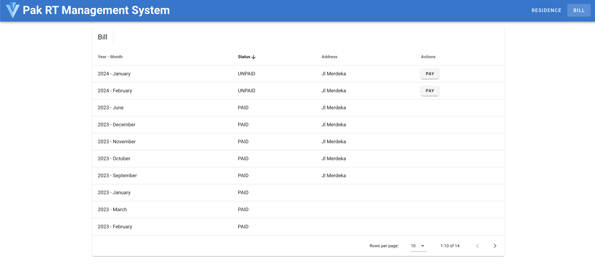
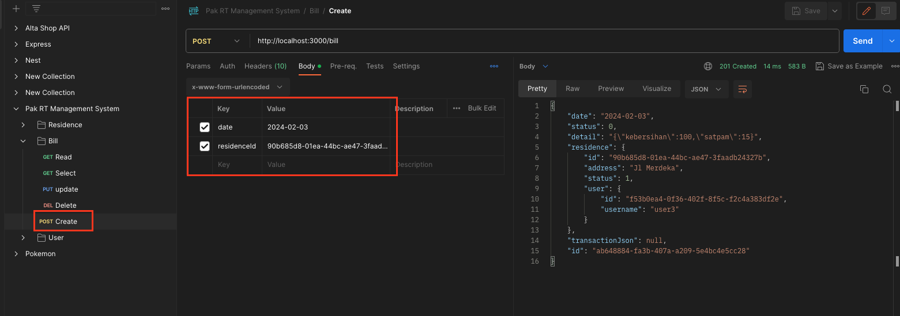
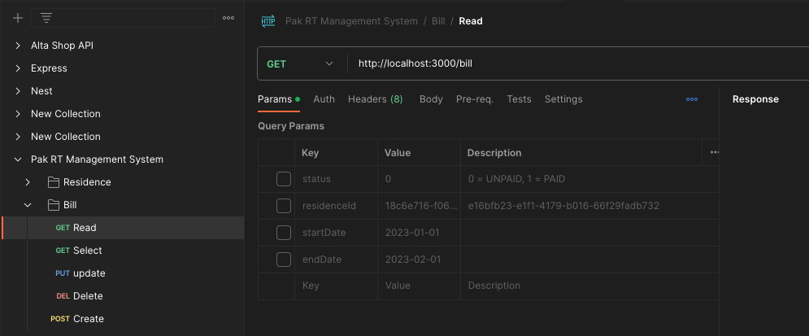

## Deskripsi
Teknikal tes untuk Fullstack di Jaghos

## Persiapan
- jalankan backend sesuai intruksi pada repository https://github.com/wildanjisung/rt-be
## Instalasi
```
npm install
```
## Hasil
- Hasil ketika aplikasi berjalan


## Feature
- Login dan Register User
- Residence Management untuk mengatur rumah dan siap penghuninya
- Bill Management untuk mengatur tagihan

## Alur Program
### Tambah Penghuni (User)
- masuk ke menu register
- masukkan username dan password
- keterangan: buat 3 akun, untuk logout clear local storage

### Mengatur rumah dan pemiliknya
#### Persiapan - Login
- masuk dengan salah satu akun dengan memasukkan username dan password pada menu login
- akan muncul menu Residence dan klik
#### Tambah Rumah

- buat data hunian, dengan menekan tombol 'NEW RESIDENCE'
- masukkan alamat
- lalu simpan

#### Tambah Penghuni pada Rumah

- klik ikon orang pada row. akan muncul kotak dialog untuk menambahkan penghuni
- pilih penghuni
note: list penhuni sesuai dengan user yang terdaftar pada saat register
- simpan

### Pembayaran tagihan perbulan
#### Persiapan
- masuk ke menu Bill, maka akan terlihat seperti berikut

- jika data tidak muncul karena belum di generate. generate dulu dengan menggunakan postman
- import dulu file postman pada repo be.

- masuk ke menu bill -> create.
- sesuaikan payload
- masukkan date '2023-04-02' untuk tagihan bulan april tahun 2023
- masukkan residenceId dengan id rumah yang telah dibuat sebelunya
- siapkan beberapa data dummy untuk penagihan rumah pada bulan tertentu

### pemabayran tagihan
- tekan tombol pay pada row
- maka tagihan akan terbayarkan

### Catatan
#### Filter Tagihan perbulan
- untuk integrasi belum terimplementasi
- namun di backend sudah ada filter untuk mendapatkan tagihan per bulan

- untuk mendapatkan filter perbulan masukkan parameter startDate dan endDate
0 untuk filter lainnya ada filter berdasarkan status dan rumah (residenceId)